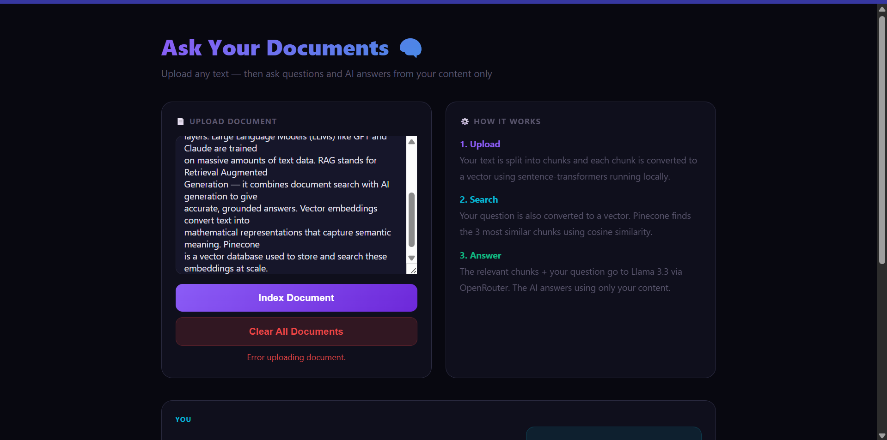
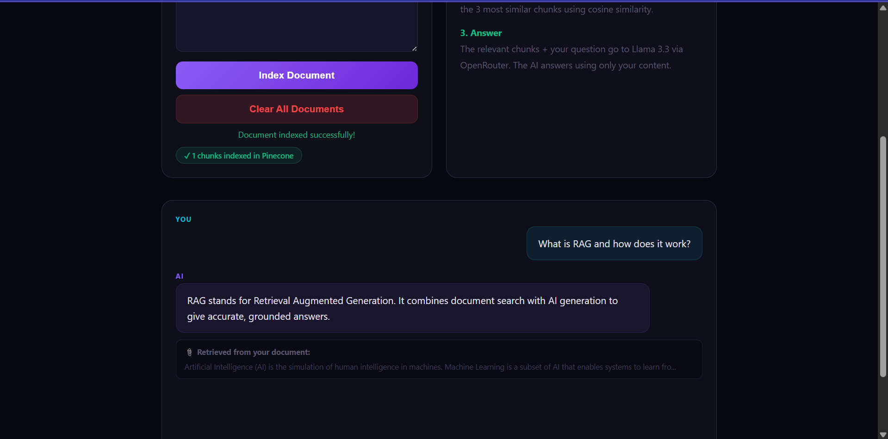

# RAG Application 🧠

Ask questions about any document — AI answers using only your content, not its training data.

## Demo



## How it works
1. Paste any text and click Index Document
2. Text is split into chunks and converted to vectors using sentence-transformers (runs locally, free)
3. Vectors stored in Pinecone vector database
4. You ask a question — it gets converted to a vector too
5. Pinecone finds the 3 most similar chunks using cosine similarity
6. Those chunks + your question go to an LLM via OpenRouter
7. AI answers using ONLY your document content

## Tech Stack
- **FastAPI** — modern Python web framework
- **sentence-transformers** — local embedding model (all-MiniLM-L6-v2)
- **Pinecone** — vector database for semantic search
- **OpenRouter** — unified API for 100+ AI models
- **HTML/CSS/JS** — frontend chat interface

## Setup
1. Clone this repo
2. Install dependencies:
```
   pip install fastapi uvicorn sentence-transformers pinecone openai python-dotenv httpx
```
3. Create a `.env` file:
```
   OPENROUTER_API_KEY=your-key
   PINECONE_API_KEY=your-key
```
4. Run: `python -m uvicorn main:app --reload`
5. Open browser at `http://127.0.0.1:8000`

## What I Learned
- RAG (Retrieval Augmented Generation) — the most in-demand AI skill
- Vector embeddings — converting text to mathematical representations
- Semantic search — finding similar content by meaning not keywords
- Pinecone vector database — storing and querying vectors at scale
- FastAPI — modern Python API framework with automatic docs
- OpenRouter — unified access to 100+ AI models with one API key